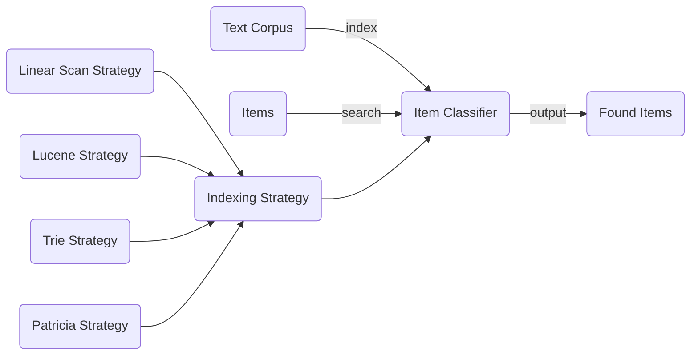

# Introduction
- Exploratory Java application for indexing a corpus of text and searching items in it using different strategies
- Exploring the use of Lucene for indexing text and searching the index using various Query techniques
- Fine-tuning for optimal results is required and is context-dependent


# Architecture 
- Input: corpus of text + items
- Output: found items



# Solution
### Technologies
- Spring
- Gradle
- Lucene

### Package Structure
- `articles`: logic for reading the text corpus
- `classifiers`:
  - Logic for finding items in the corpus of text
  - Has several indexing strategies: Linear Scan, Lucene, Patricia, Trie
- `companies`: logic for reading items
- `configuration`: bean creation
- `lucene`: abstraction for an In Memory Lucene Index
- `printer`: logic for printing the results
- `transformers`: logic for applying different types of transformers on the corpus of text before indexing it

### Conceptual Approach
The central piece of the solution revolves around searching for items in the corpus of text in an efficient manner:
- The naive approach does a linear scan
- More complex and advanced approaches build an index from the corpus of text and perform the search on this index to improve performance (both time and space-wise)
  - Trie
  - Patricia (reduces the storage requirements by compressing common paths)
  - Lucene (uses an In Memory Lucene Index)

Current implementations:
- Linear Scan Strategy
- Lucene Strategy

Future directions:
- Trie Strategy
- Patricia Strategy

### Linear Scan
Does a linear scan over the entire corpus of text and tries to find a match for each item.

### Trie 
These method needs careful analysis of the input companies to determine the max length of the words that should be stored in the data structures. 
There are two approaches:
1. Number of characters: determine the maximum length of an item and cap the length of sequence of terms to that. 
   - Example: maxLength(Tuesday Was Sunny) = 15
2. Number of terms: determine the maximum length of terms an item consists of and cap the length of the sequencer of terms to that.
   - Example: maxTerms(Tuesday Was Sunny) = 3

### Patricia
The as for the `Trie` Strategy applies. Space usage is more efficient int this case.

### Lucene
Lucene does most of the work out of the box for us: creating an efficient indexing structure, splitting, lowercase conversion, punctuation removal, etc.
 
# Testing
- Parameterized tests for each test cases and for each strategy

# Prerequisites
- Java 11 is available on your system (tested with Java 11 and Java 18)
- Make sure that the CSV file for the input items to search for has the following header names (please rename the headers if required):
  - `Company ID`
  - `Company Name`

# Running the application

### Params
- The corpus of text: initialize `articles.path` with the path to the text corpus directory. Escape the path if required. 
- The items to search for: initialize `companies.path` with the path to the items file. Escape the path if required.
- There will be multiple `spring.profiles.active` properties:
  - Indexing strategy: initialize `spring.profiles.active` with one of `[linearScanStrategy, luceneStrategy, trieStrategy, patriciaStrategy]`. 
    - Current implementations only for `linearScanStrategy` and `luceneStrategy`.
    - Expect running times around `minutes, 10s of minutes, or even hours` for `linearScanStrategy`, depending on the size of you corpus and hardware configuration
    - Expect running times around `seconds to 10s of seconds` for `luceneStrategy`, depending on the size of your corpus and hardware configuration
  - Printing the found companies: initialize `spring.profiles.active` with one of `[idPrinter, idAndNamePrinter]`

### CMD

```groovy
./gradlew -q bootRun -Pargs=--articles.path=<articles-directory-path>,--companies.path=<companies-file-path>,--spring.profiles.active=luceneStrategy,--spring.profiles.active=idAndNamePrinter
```

You can pipe the execution to a file, if you want to store the results for later analysis.

### Notes
- This should also work under Windows using Git Bash. Otherwise, use the `gradlew.bat` version for pure Windows systems.
- If you also want to see the running time, add `time` before the previous command, if available on your system.

### Errors
- Please consult the contents of the `application.log` file if problems arise. This can be found in the root directory.

# Future directions
- **Trie**: the structure for this work is present, but the approach needs to be implemented
- **Patricia**: the structure for this work is present, but the approach needs to be implemented
- **TransformerChain**: uses an implicit Identity transformer. More complex transformers can be added and be used on without altering existing code.
- **Item Names (Aliases)**: 
  - The items might have multiple aliases that refer to the same concept. 
  - Work that identifies these from an item and stores them so we can search for any alias needs to be done. 
  - This would be done as part of reading the items list. 
  - After this, a search would be done for every alias and a hit generated when at least one of the names matches.
- **Injection**: Some fields were injected with @Autowired. This should be replaced with Constructor Injection
- **Precision/Recall**
  - The current implementation for Lucene Strategy uses a `PhraseQuery` for searching an item in the index.
  - This matches documents containing a particular sequence of terms and uses a slop factor to determine how many positions may occur between any two terms in the phrase and still be considered a match: https://lucene.apache.org/core/9_1_0/core/org/apache/lucene/search/package-summary.htm 
  - This can further be improved by incorporating Fuzzy Queries that use Levenshtein distance: https://en.wikipedia.org/wiki/Levenshtein_distance

